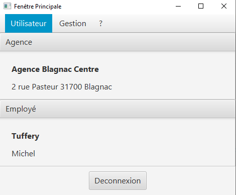
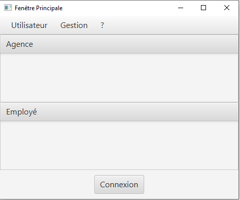
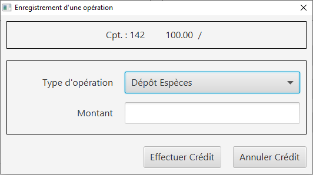
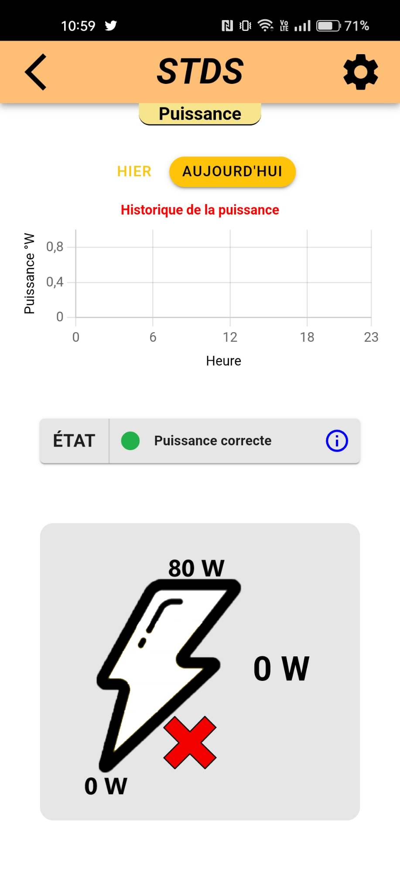
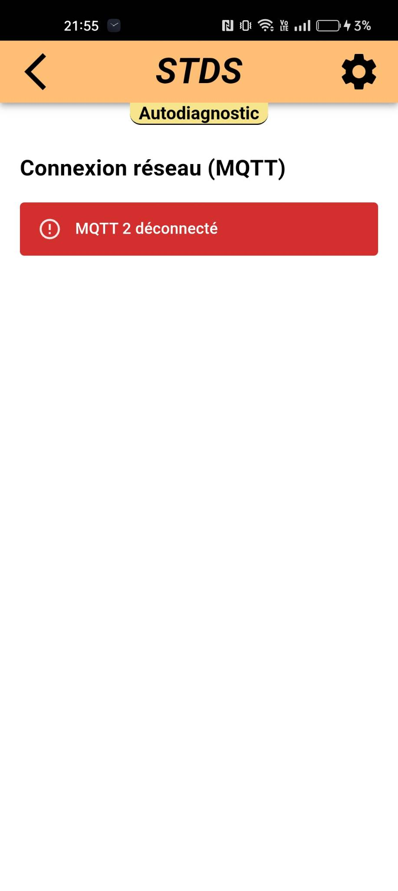
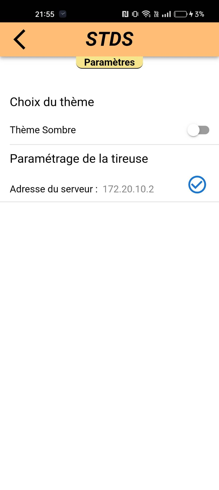
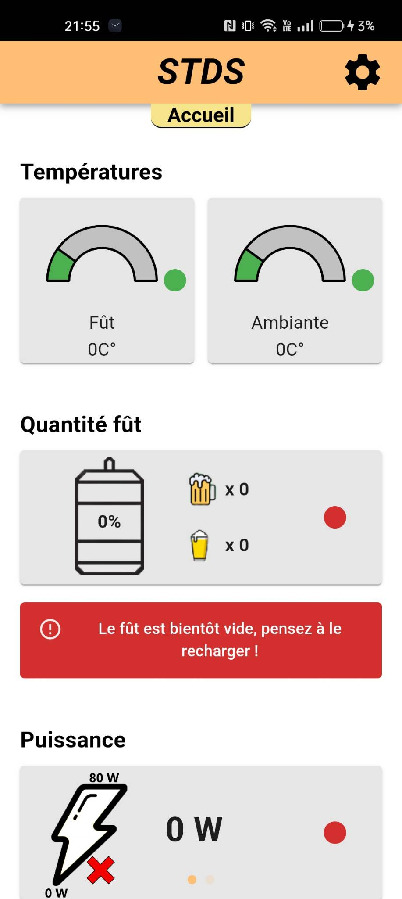
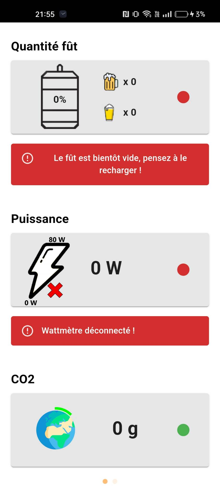
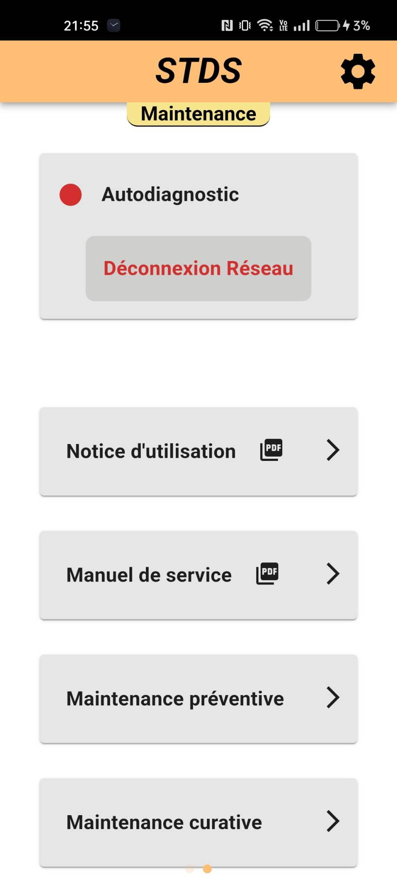
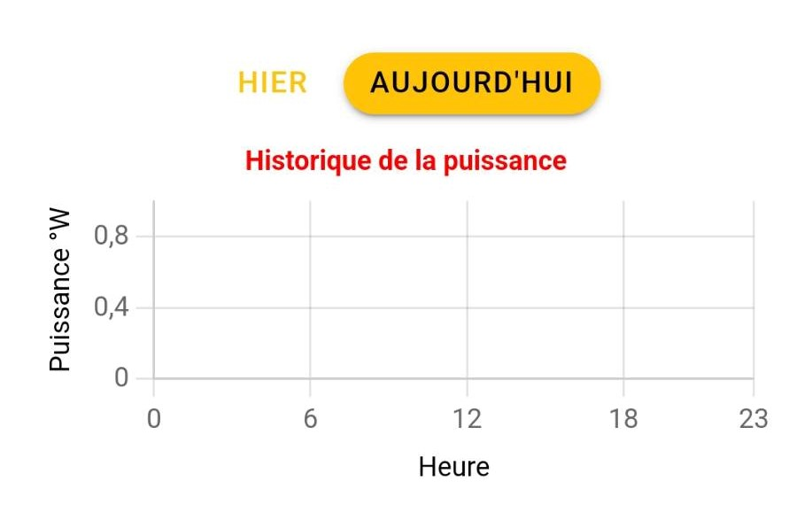

# Portfolio
Traces des 6 compétences développées lors du Semestre 3 de BUT Informatique

## Introduction

Tout au long du BUT informatique des projets (SAE / Situation d'apprentissage et d'évaluation) ainsi que des TP nous ont permis de mettre en œuvre les 6 compétences développées durant ces deux années.
Ce dépôt permet de mettre les traces de ces projets , TP mais aussi expérience professionnel et personnel pour lequel ces compétences ont étés développées ou mise en œuvre.

## Sommaire 

 ##### COMPÉTENCE 1 : RÉALISER UN DÉVELOPPEMENT D'APPLICATION 
 ######   - Sélectionner les algorithmes adéquats pour répondre à un problème donné

 ##### COMPÉTENCE 2 : OPTIMISER DES APPLICATIONS
 ######   - Sélectionner les algorithmes adéquats pour répondre à un problème donné

 ##### OMPÉTENCE 3  : ADMINISTRER DES SYSTÈMES INFORMATIQUES COMMUNICANTS COMPLEXES
 ######   - Déployer des services dans une architecture réseau
 
 ##### COMPÉTENCE 4 GÉRER DES DONNÉES DE L'INFORMATION
 ######   - Optimiser une base de données, interagir avec une application et mettre en œuvre la sécurité

 ##### COMPÉTENCE 5 CONDUIRE UN PROJET 
 ######   - Appliquer une démarche de suivi de projet en fonction des besoins métiers des clients et des utilisateurs
 
 ##### COMPÉTENCE 6 COLLABORER AU SEIN D'UNE ÉQUIPE INFORMATIQUE
 ######   - Situer son rôle et ses missions au sein d'une équipe informatique

## COMPÉTENCE 1 : RÉALISER UN DÉVELOPPEMENT D'APPLICATION 

Cette compétence a été développée lors de la SAE S2-01 avec le développement d'une application bancaire en Java.
Nous étions par groupe de 3 étudiants lors de cette SAE et nous avons récupéré une base d'application sans fonctionnalités.
Nous avons donc dû ajouter les différentes fonctionnalités demandées pour chaque version

vous pouvez retrouver le depot de cette SAE grace au lien ci-dessous :

https://github.com/IUT-Blagnac/SAE-S2-01-1A01

Quelques images afin de présenter l'application crée lors de cette SAE

Cette compétence à aussi été développée lors de la SAE S3.A.01 avce la création d'une application mobile.
Voici quelques visuels de cette application : 

## COMPÉTENCE 2 : OPTIMISER DES APPLICATIONS

Cette compétence à été développée au cours du module "programmation efficace" et plus précisément dans le TP 3
Nous devions optimiser une application en Java.

Vous retrouverez le workspace avec ce lien : 
https://github.com/BryceFuerty/Portfolio/blob/main/TP/TP4_ProgEff.zip

Ainsi qu'un compte rendu de ce TP : 
https://github.com/BryceFuerty/Portfolio/blob/main/TP/TP4_ProgEff_cptRendu.pdf

## COMPÉTENCE 3  : ADMINISTRER DES SYSTÈMES INFORMATIQUES COMMUNICANTS COMPLEXES

Cette compétence à été développée au cours du module "Architecture réseau" et plus précisément dans le TP 3
Dans ce TP nous devions mettre en place un réseau et l'adiministrer afin que tout les composants de ce réseau puissent communiquer entre eux.

Vous trouverez le compte rendu de ce TP ici :
https://github.com/BryceFuerty/Portfolio/blob/main/TP/TP3_Archi.pdf

## COMPÉTENCE 4 GÉRER DES DONNÉES DE L'INFORMATION

Cette compétence a été développée avec la SAE S3 01 avec l'enregistrement des données provenant d'un MQTT dans une base de donnée InfluxDB afin d'utiliser ces données dans es graphiques d'historiques.
Comme vous pouvez le voir ci-dessous.

Le MQTT n'étant pas connecté lors de la capture d'écran

Vous pourrez retrouver cette SAE avec une explication plus détaillée de celle-ci ici :
https://github.com/Falsimane/SAE-ALT-S3-Dev-22-23-STDS-3B-Equipe-4

## COMPÉTENCE 5 CONDUIRE UN PROJET 

Cette compétence à été dévelopée lors de la SAE S3 01 avec la gestion de développement d'une application.
Sa mise en oeuvre c'est illustrée par la mise en place de milestones et d’issues GitHub correspondant au différents sprints , fonctionnalitées de l'application aisni que des étapes du développement. Mais aussi avec la mise en place de point réguliers avec toute l'équipe nous permettant de distribuer les taches à réaliser en fonction des compétences de chacun.

Vous pourrez retrouver cetet SAE ainsi que des documentation techniques et utilisateurs ici

 - Projet : https://github.com/Falsimane/SAE-ALT-S3-Dev-22-23-STDS-3B-Equipe-4
 - Documentation technique : https://github.com/Falsimane/SAE-ALT-S3-Dev-22-23-STDS-3B-Equipe-4/blob/main/Documentation/documentation_technique.adoc
 - Docuemntation utilisateur : https://github.com/Falsimane/SAE-ALT-S3-Dev-22-23-STDS-3B-Equipe-4/blob/main/Documentation/documentation_utilisateur.adoc
 

## COMPÉTENCE 6 COLLABORER AU SEIN D'UNE ÉQUIPE INFORMATIQUE

Cette compétence a été développé lors de deux SAE : SAE S3 01 et SAE S2 01

Durant la SAE S3 01 j'ai développé cette compétence en travaillants avec mes camarades, nous étions un groupe de 5 étudiants. Dont 3 développeurs, 1 Product Owner et 1 Scrum Master. 
Je faisais partie des 3 développeurs et j'ai donc pu travailler en collaboration avec eux et développer ma compétence de collaboration

Vous trouverez le lien vers cette SAE [ici](https://github.com/Falsimane/SAE-ALT-S3-Dev-22-23-STDS-3B-Equipe-4).

Durant la SAE S2 01 j'ai aussi eu l'occasion de développer cette compétence en collaborant avec 2 camarades développeurs dans le développement d'une application bancaire en Java. Des version d'application à créer nous étants données toutes les deux semaines, nous devions collaborer au mieux possible afin de suivre le rythmer de ce projet.

Vous trouverez le lien vers cette SAE [ici](https://github.com/IUT-Blagnac/SAE-S2-01-1A01).

